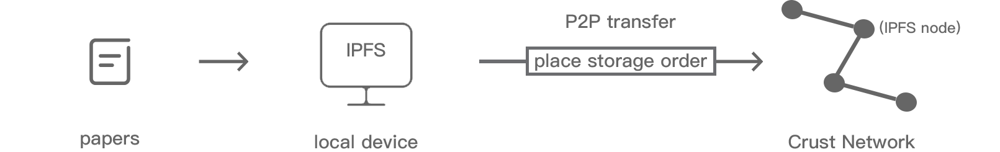

# Decentralized SCIHub

## Goal

To build an unstoppable SCIHub, We could migrate all the papers into IPFS and capture the indexs, then develop a mirror page that retrieves all the papers from IPFS. It's very hard to download 80+TB of data and pinning them by one person. It will be very helpful if we could have a co-work with all the paper maintainers and developers.

## Cases

We use this repo to collaborate in the following areas:
- :white_check_mark:Host web page to assist torrent maintainers to put the document on IPFS;
- :chart_with_upwards_trend:Collect the index files pushed by all the torrent maintainers;
- :construction:Develop an API that can use the index files;
- :construction:Host a decentralized SCIHub;

## Usage

### Upload papers

#### Logic

#### Front-end

We provide a front-end page to help maintainers upload papers, this page is also permanently stored on the decentralized network. For now, the page link is:

https://ipfs.io/ipfs/QmRLHYiCdeaNikqqGiShX1f7NeL23wL1ccqrpFz9PoBnGx/

### Contribute code
Thank you for considering to help out with the source code! Welcome contributions from anyone on the internet, and are grateful for even the smallest of fixes!
If you'd like to contribute to crust, please **fork, fix, commit and send a pull request for the maintainers to review and merge into the main codebase**.

#### Rules
Please make sure your contribution adhere to our coding guideliness:
- **No --force pushes** or modifying the main branch history in any way. If you need to rebase, ensure you do it in your own repo.
- Pull requests need to be based on and opened against the `main branch`.
- A pull-request **must not be merged until CI** has finished successfully.
- Make sure your every `commit` is [signed](https://help.github.com/en/github/authenticating-to-github/about-commit-signature-verification)

### Donate

This repo is completely nonprofit and does not involve any commercial purpose. Your donation can make us better.

- ETH address: [0x814759640e3D821a5b6Af80b456c2848499bb03f](https://etherscan.io/address/0x814759640e3D821a5b6Af80b456c2848499bb03f)
- CRU adddress: [cTJHhWQRSFDwAn6kBWGsHdQRoQdJbzioDamAw84wPSbLdGmVv](https://crust.subscan.io/account/cTJHhWQRSFDwAn6kBWGsHdQRoQdJbzioDamAw84wPSbLdGmVv)
